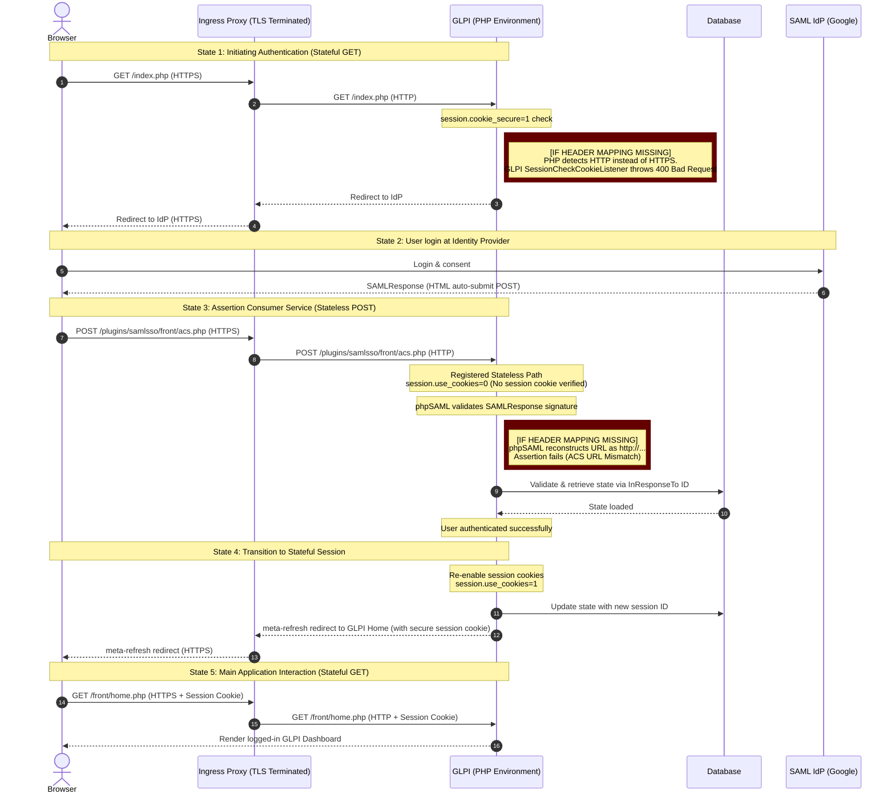

# ADR 0016: Reverse Proxy HTTPS Context and Cookie Security Alignment

## Status
Accepted

## Context
When the plugin is deployed in reverse-proxied environments (such as Kubernetes setups utilizing Traefik or nginx Ingress controllers with TLS termination at the ingress level), PHP inside the application containers does not natively detect that the browser request was made over HTTPS. This leads to two critical failures:
1. **Assertion Validation Failure**: The phpSAML toolkit (`OneLogin\Saml2\Utils`) reconstructs the current request URL using `http://` instead of `https://`. When validating the SAML response against the configured Assertion Consumer Service (ACS) endpoint (which is configured as `https://`), validation fails with an ACS URL mismatch error.
2. **Session Cookie Security Enforcement Block**: GLPI enforces that `session.cookie_secure` must be enabled in production environments. GLPI's `SessionCheckCookieListener` checks if the incoming request is secure (`$request->isSecure()`). If `session.cookie_secure` is enabled but PHP perceives the connection as insecure (HTTP), GLPI throws a `BadRequestHttpException` resulting in an HTTP 400 Bad Request on the ACS endpoint.

A proposed enhancement suggested that the plugin dynamically set `SameSite=None` and `Secure` attributes on session cookies when the plugin configuration has "Requests Proxied" enabled.

### SAML Auth Flow & Failure Points

### Scenario Analysis (Succeed vs. Break)

The table below details how various environment configurations interact with `session.cookie_secure` and proxy settings to cause or prevent login failures:

| Scenario | Proxy Headers Mapped? | `session.cookie_secure` | `session.cookie_samesite` | ACS Validation | Redirect & Session Setup | Status | Failure Mode / Reason |
| :--- | :---: | :---: | :---: | :---: | :---: | :---: | :--- |
| **1. Direct Apache** | N/A | `on` | `Lax` / `Strict` | ✅ Success | ✅ Success | **✅ Works** | Native secure context. Browser accepts cookies; phpSAML reconstructs correct HTTPS URLs. |
| **2. TLS Offload (No proxy mapping)** | ❌ No | `on` | `Lax` / `Strict` | ❌ **Fail** | - | **❌ Breaks** | GLPI's `SessionCheckCookieListener` throws a `BadRequestHttpException` (HTTP 400) because `cookie_secure` is true but connection is seen as HTTP. |
| **3. TLS Offload (With proxy mapping)** |  Yes | `on` | `Lax` / `Strict` | ✅ Success | ✅ Success | **✅ Works** | With `$_SERVER['HTTPS'] = 'on'`, the request is secure to PHP. Redirect and login succeed. |
| **4. Containerized Proxy (No mapping)** | ❌ No | `on` | `Lax` / `Strict` | ❌ **Fail** | - | **❌ Breaks** | Same as Scenario 2. The `SessionCheckCookieListener` blocks request execution. phpSAML also fails due to ACS URL mismatch. |
| **5. Containerized Proxy (With mapping)** |  Yes | `on` | `Lax` / `Strict` | ✅ Success | ✅ Success | **✅ Works** | Proxy environment is correctly mapped. The stateless ACS POST succeeds, and the browser receives the new secure cookie on redirect. |

## Decision
We decided **not** to implement dynamic plugin-level session cookie overrides (such as auto-enforcing `SameSite=None` or modifying PHP INI settings at runtime). 

Instead:
1. We align with the architectural design that the ACS path is registered as stateless (`SessionManager::RegisterPluginStatelessPath`) and operates without session cookie dependency during the cross-site POST.
2. We require the application container or host environment configuration (`config/local_define.php`) to correctly map proxy header variables to make the HTTPS context available to PHP, rather than altering cookie attributes in the plugin logic.

Users must configure:
* `GLPI_USE_SECURE_COOKIES` defined as `true` in `config/local_define.php`.
* Proxy header mapping in `config/local_define.php` to populate `$_SERVER['HTTPS'] = 'on'` when `HTTP_X_FORWARDED_PROTO` matches `https`.

## Consequences
* **Positive**:
  - The plugin preserves the integrity of GLPI core's session management and does not introduce potential security vulnerabilities by overriding global security settings (`SameSite`).
  - Correct HTTPS context reporting fixes both the phpSAML validation URL construction and GLPI's core session security listener checks.
  - Keeps the plugin decoupled from low-level PHP session cookie management.
* **Negative**:
  - Requires administrators hosting GLPI behind a TLS-terminating reverse proxy to manually append a configuration snippet in `config/local_define.php`. This must be clearly highlighted in the plugin deployment documentation.
